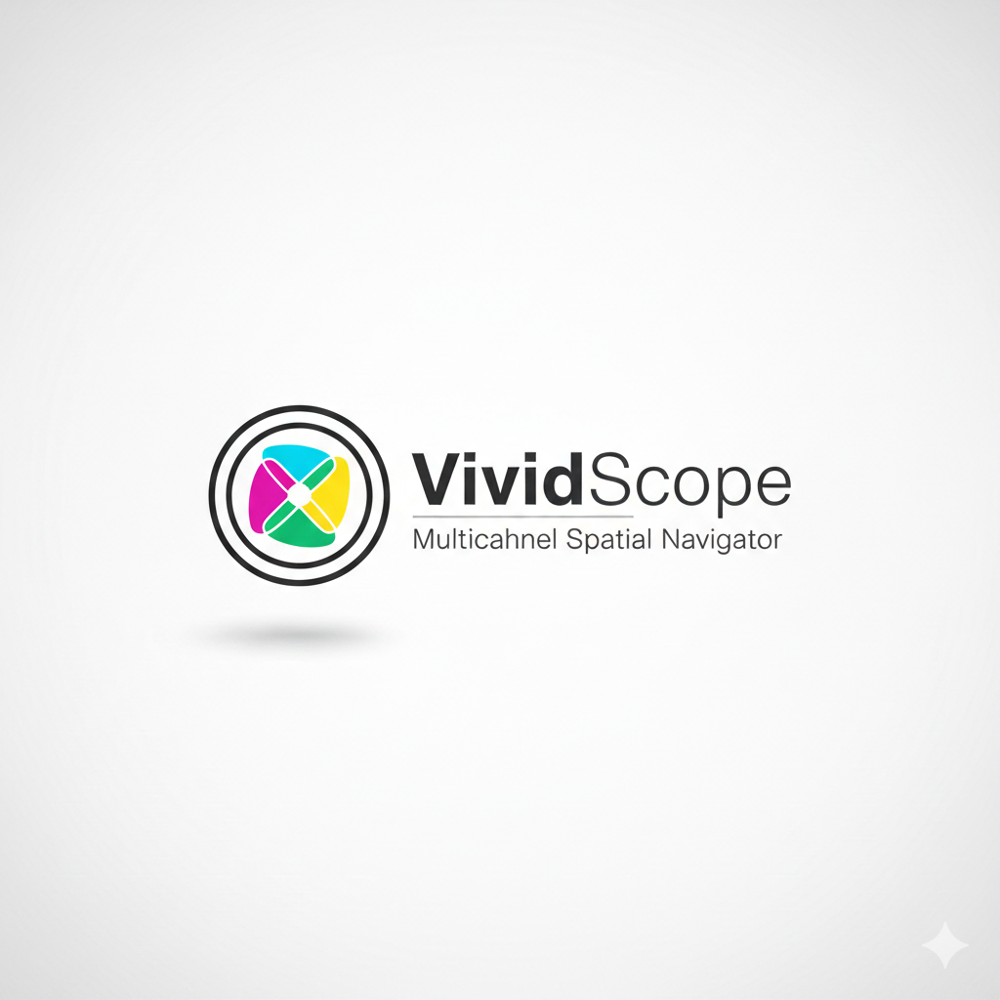

# VividScope

**Multichannel Spatial Navigator**

<div align="center">
  
</div>

A powerful, professional-grade multichannel MIBI (Multiplexed Ion Beam Imaging) image viewer built with napari, featuring FIJI/ImageJ-style adjustment sliders, advanced overlay capabilities, and intuitive channel management.

## Features

### Core Functionality
- **Multichannel Support**: Load and display multiple MIBI channels simultaneously
- **Single & Multi-Channel Modes**: Switch between focused single-channel viewing and multi-channel overlay comparison
- **FIJI-style Adjustments**: Per-channel adjustment controls including:
  - **Brightness**: Adjust image brightness (-1.0 to 1.0)
  - **Contrast**: Adjust image contrast (0.01 to 2.0)
  - **Gamma**: Apply gamma correction (0.01 to 5.0)
  - **Display Range**: Set minimum and maximum display values (0.0 to 1.0)
- **Real-time Updates**: Instant visual feedback as you adjust parameters (with performance-optimized debouncing)

### Advanced Features
- **Color Assignment**: Assign custom colors to each channel in multichannel mode for easy overlay comparison
- **Selective Overlay**: Choose which channels to overlay - not all channels need to be visible simultaneously
- **Channel Search**: Quickly find channels using the search box
- **Quick Navigation**: Channel list widget for fast channel selection
- **Channel Slider**: Navigate through channels with a horizontal slider (single-channel mode)
- **Visibility Control**: Show/hide individual channels with checkboxes
- **Reset Controls**: Reset individual channels or all channels at once
- **Progress Tracking**: Visual progress bar during folder loading

### User Interface
- **Scrollable Adjustment Panel**: Fixed-height, always-visible vertical scrollbar for long channel lists
- **Adaptive Layout**: UI elements automatically adjust to window size
- **Tooltips**: Helpful tooltips on all interactive elements
- **Professional Design**: Clean, modern interface optimized for scientific image analysis

## Installation

### Prerequisites
- Python 3.8 or higher
- Windows, macOS, or Linux

### Installation Options

You can use VividScope in two ways:

#### Option 1: Download Release (Recommended for Users)
1. Go to the [Releases](https://github.com/Audrey-Li-CPEN/VividScope-Multi-channel-Spatial-Image-Viewer/releases) page
2. Download the latest release package
3. Extract the files
4. Follow the installation instructions included in the release

#### Option 2: Developer Mode (For Contributors and Advanced Users)
1. **Clone the repository:**
   ```bash
   git clone https://github.com/Audrey-Li-CPEN/VividScope-Multi-channel-Spatial-Image-Viewer.git
   cd VividScope-Multi-channel-Spatial-Image-Viewer
   ```

2. **Create a virtual environment (Recommended):**
   ```bash
   # Using conda
   conda create -n mibiview python=3.11
   conda activate mibiview
   
   # Or using venv
   python -m venv mibiview
   # On Windows:
   mibiview\Scripts\activate
   # On macOS/Linux:
   source mibiview/bin/activate
   ```

3. **Install dependencies:**
   ```bash
   pip install -r requirements.txt
   ```

4. **Run the application:**
   ```bash
   python mibi_viewer.py
   ```

**Note**: The VividScope icon files (`vividscope_icon.png` and `vividscope_icon.ico.png`) are included in the repository and will be automatically used by the application.

## Usage

### Starting the Viewer

1. **Launch the application**:
   ```bash
   python mibi_viewer.py
   ```

2. **Load a MIBI folder**:
   - Click the **"Load MIBI Folder"** button
   - Navigate to and select a folder containing TIFF files (e.g., `fov-10-scan-1`)
   - The viewer will automatically:
     - Scan for all `.tiff` and `.tif` files
     - Load all channels
     - Create adjustment controls for each channel
     - Display channels in the napari viewer

### Working with Channels

#### Single-Channel Mode
- Click **"Single Channel"** mode button
- Use the horizontal slider at the bottom to navigate through channels
- Adjust parameters using the sliders or spinboxes
- All adjustments are applied in real-time

#### Multi-Channel Mode
- Click **"Multi-Channel"** mode button
- **Overlay channels**: Check the "Overlay" checkbox for channels you want to compare
- **Assign colors**: Click the color button next to each channel to assign a custom color
- **Visibility**: Use the "Visible" checkbox to show/hide channels
- **Selective overlay**: Only overlay the channels you need - uncheck "Overlay" for channels you don't want to compare

#### Adjusting Channel Parameters

Each channel has independent adjustment controls:

- **Brightness Slider/Spinbox**: 
  - Range: -1.0 to 1.0
  - Adds or subtracts a value from the image
  - Negative values darken, positive values brighten

- **Contrast Slider/Spinbox**:
  - Range: 0.01 to 2.0
  - Multiplies the contrast around the midpoint
  - Values < 1.0 reduce contrast, > 1.0 increase contrast

- **Gamma Slider/Spinbox**:
  - Range: 0.01 to 5.0
  - Applies gamma correction
  - Values < 1.0 brighten (especially dim areas), > 1.0 darken

- **Min/Max Spinboxes**:
  - Range: 0.0 to 1.0
  - Sets the display range (clipping)
  - Useful for focusing on specific intensity ranges

#### Channel Management

- **Search**: Type in the "Find Channel" search box to filter channels
- **Quick Select**: Click on a channel name in the channel list widget
- **Show All**: Click "Show All Channels" to make all channels visible
- **Hide All**: Click "Hide All Channels" to hide all channels
- **Reset**: 
  - Individual: Click "Reset" on any channel widget
  - Global: Click "Reset All Channels" to reset all channels to defaults

### Keyboard Shortcuts

Standard napari shortcuts apply:
- `Space`: Play/pause (for time series)
- `F`: Toggle fullscreen
- `Ctrl+S`: Save screenshot
- `Mouse wheel`: Zoom in/out
- `Right-click drag`: Pan
- `Left-click drag`: Select region (if applicable)

## File Structure

Your MIBI data should be organized in folders, with each folder containing multiple TIFF files representing different channels:

```
project-root/
  ├── fov-10-scan-1/
  │   ├── CD3.tiff
  │   ├── CD8.tiff
  │   ├── GFAP.tiff
  │   ├── CD44.tiff
  │   └── ... (other channel files)
  ├── fov-9-scan-1/
  │   └── ... (channel files)
  └── ...
```

**Note**: FOV (Field of View) data folders are automatically ignored by git (see `.gitignore`) to protect privacy-sensitive data.

## Tips & Best Practices

### For Single-Channel Analysis
- Use **Single-Channel mode** for detailed examination of individual channels
- Adjust **gamma** (typically 0.5-0.8) to better visualize dim signals
- Use **display range** to focus on specific intensity ranges
- The channel slider makes it easy to quickly compare different channels

### For Multi-Channel Overlay
- Assign **distinct colors** to channels you want to compare (e.g., red, green, blue)
- Use **selective overlay** - only overlay channels that are relevant to your analysis
- Adjust **brightness and contrast** per channel to balance overlay visibility
- Start with **gamma ~0.7** for better dim signal visualization
- Use **visibility checkboxes** to quickly toggle channels on/off

### Performance
- The viewer uses **lazy loading** - images are loaded only when needed
- Adjustments are **debounced** (150ms delay) to prevent UI lag during rapid changes
- Large datasets may take time to load - watch the progress bar

### Workflow Recommendations
1. Load your folder
2. Switch to **Multi-Channel mode**
3. Assign colors to channels of interest
4. Enable overlay for channels you want to compare
5. Adjust brightness/contrast/gamma to balance the overlay
6. Switch to **Single-Channel mode** for detailed analysis of specific channels
7. Use the search box to quickly find specific channels in large datasets

## Requirements

- **Python**: 3.8 or higher
- **napari**: >= 0.4.18
- **tifffile**: >= 2023.1.0
- **numpy**: >= 1.21.0
- **qtpy**: >= 2.0.0
- **PyQt5**: >= 5.15.0

## Technical Notes

- **Image Normalization**: All images are automatically normalized to 0-1 range for consistent display
- **Non-destructive**: All adjustments are applied to display only - original data is preserved
- **Memory Efficient**: Uses lazy loading and caching strategies for large datasets
- **Real-time Updates**: Optimized with debouncing to prevent UI freezing during rapid adjustments

## Troubleshooting

### Application won't start
- Ensure all dependencies are installed: `pip install -r requirements.txt`
- Check Python version: `python --version` (should be 3.8+)

### Images not loading
- Verify TIFF files are in the selected folder
- Check file format - should be `.tiff` or `.tif`
- Ensure files are not corrupted

### UI is slow/unresponsive
- Reduce the number of visible channels
- Close other applications to free up memory
- For very large datasets, consider processing in batches

## License

This project is licensed under the MIT License - see the [LICENSE](LICENSE) file for details.

## Contributing

Contributions are welcome! Please feel free to submit a Pull Request.

## Support

For issues, questions, or feature requests, please open an issue on the [GitHub repository](https://github.com/Audrey-Li-CPEN/VividScope-Multi-channel-Spatial-Image-Viewer).

---

**Built with**: napari, PyQt5, NumPy, tifffile

**VividScope** - *Multichannel Spatial Navigator*
